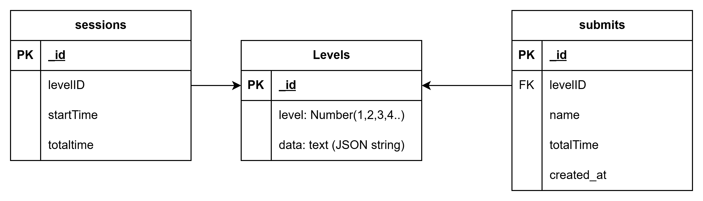

# SUDOKU WITH ZKP

## Chạy?
0. Tạo thư mục `.env` trong folder `backend`, clone từ `.envexample` và sửa theo máy mình. 
1. Chạy backend:  `npm i `, `npm run dev` trong folder backend 
2. Chạy database:  `docker compose up ` trong thư mục gốc
3. Chạy frontend: `npm i`, `npm run dev` trong thư mục frontend (chưa code :>)

|Service|Port|
|:---|:---|
|Database|27018|
|MongoExpress|8081|
|Backend|4000|
|Frontend|3000|


## Xem database?
*localhost:8081*

## Database



- data trong levels: là JSON string lưu  bảng 9*9 (màn chơi)
- trong bảng session, khi người dùng truy cập 1 level, tạo 1 sessions với levelid tương ứng, starttime tương ứng, totaltime = 0. Khi người dùng bấm pause, lưu lại totaltime
- Khi người dùng bấm start, lưu lại `starttime = thời gian hiện tại`
- Khi người dùng hoàn thành, client tạo bằng chứng, server verify, cộng thời gian và thêm vào bảng submit
- Không lưu dữ liệu khi người chơi restart lại


## List API

Nếu thành công, response code==200
1. Tạo Session
Tạo 1 bản ghi session như yêu cầu
```
input: null
output: sessionid
```
2. Pause
Cập nhật session như yêu cầu
```
input: sessionid
output: null
```
3. Start
Cập nhật session như yêu cầu
```
input: sessionid
output:null 
```
4. Submit

Verify bằng chứng, lấy tổng thời gian và thêm vào bảng submit
```
input: sessionid, name
output: Tổng thời gian (nếu verify thành công)
```
5. Lấy danh sách HighScore
```
input: levelid
output: danh sách đã submit sắp xếp theo thời gian tăng dần
```
6. Lấy danh sách các level
```
input: null
output: danh sách các level
```

